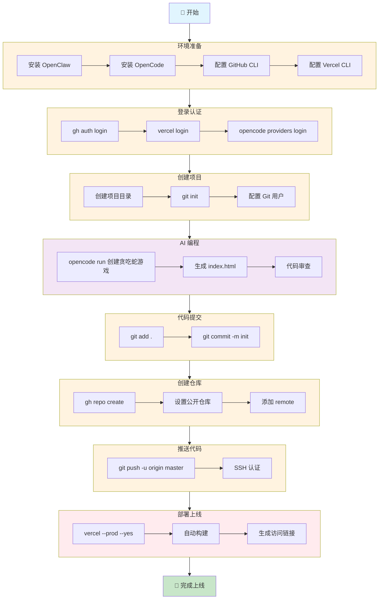

# OpenClaw + OpenCode + GitHub + Vercel 实现 Agent Coding

> 🚀 **从零到上线，只需几分钟！看 AI Agent 如何自动化完成整个开发部署流程**

---

## 📖 前言

还在手动写代码、配置环境、部署上线？OUT 啦！

今天给大家展示一个超酷的 **Agent Coding 工作流**：使用 **OpenClaw** 作为 AI 助手，配合 **OpenCode** 进行代码生成，通过 **GitHub** 版本管理，最后用 **Vercel** 一键部署。

**从零开始到网站上线，全程自动化，只需几分钟！** 🎉

---

## 🎯 项目成果

**在线演示：** [贪吃蛇游戏](https://snake-game-sigma-umber.vercel.app)

**GitHub 仓库：** [fanshengliang/snake-game](https://github.com/fanshengliang/snake-game)

---

## 🛠️ 技术栈

| 工具 | 作用 |
|------|------|
| **OpenClaw** | AI 助手，负责流程编排和任务执行 |
| **OpenCode** | AI 编程 Agent，负责代码生成 |
| **GitHub CLI** | 仓库管理和代码推送 |
| **Vercel CLI** | 网站部署和托管 |

---

## 📊 完整流程图



---

## 📝 详细步骤解析

### 步骤 1️⃣：环境准备

**安装必要工具：**

```bash
# 安装 OpenClaw (AI 助手)
npm install -g openclaw

# 安装 OpenCode (AI 编程)
npm install -g opencode-ai

# 安装 GitHub CLI
# Windows 推荐使用 winget 或下载 MSI 安装包
winget install GitHub.cli

# 安装 Vercel CLI
npm install -g vercel
```

**验证安装：**

```bash
openclaw --version
opencode --version
gh --version
vercel --version
```

---

### 步骤 2️⃣：登录认证

**GitHub 登录：**

```bash
gh auth login
# 选择 HTTPS 或 SSH 协议
# 浏览器扫码授权
```

**Vercel 登录：**

```bash
vercel login
# 选择 GitHub/Email 等方式登录
```

**OpenCode 配置：**

```bash
opencode providers login
# 选择 AI 提供商（推荐 OpenCode Zen）
# 完成 API Key 配置
```

---

### 步骤 3️⃣：创建项目

```bash
# 创建项目目录
mkdir snake-game
cd snake-game

# 初始化 Git 仓库
git init

# 配置 Git 用户（首次使用）
git config --global user.name "Your Name"
git config --global user.email "you@example.com"
```

---

### 步骤 4️⃣：AI 编程

**使用 OpenCode 生成代码：**

```bash
opencode run "创建一个贪吃蛇游戏，使用 HTML + CSS + JavaScript，单文件 index.html，包含完整的游戏逻辑、得分系统、键盘控制、游戏结束判定"
```

**OpenCode 会：**
- 🤖 分析需求
- 📝 生成完整代码
- 💾 保存到 `index.html`

**生成的代码包含：**
- 🐍 贪吃蛇移动和生长逻辑
- 🍎 食物随机生成
- 💀 碰撞检测（边界和自咬）
- 📊 计分系统
- ⌨️ 键盘方向键控制
- 🎨 现代化 UI 设计

---

### 步骤 5️⃣：代码提交

```bash
# 添加所有文件到暂存区
git add .

# 提交代码
git commit -m "feat: 创建贪吃蛇游戏 (by opencode)"
```

---

### 步骤 6️⃣：创建 GitHub 仓库

```bash
# 创建公开仓库
gh repo create snake-game --public
```

**可选参数：**
- `--add-readme` - 添加 README 文件
- `--description` - 添加项目描述
- `--private` - 创建私有仓库

---

### 步骤 7️⃣：推送代码

```bash
# 添加远程仓库
git remote add origin git@github.com:your-username/snake-game.git

# 推送代码
git push -u origin master
```

**⚠️ 注意事项：**
- 首次推送可能需要配置 SSH Key
- 确保 GitHub 账号已添加公钥
- 如遇权限问题，检查 `gh auth status`

---

### 步骤 8️⃣：部署上线

```bash
# 部署到 Vercel 生产环境
vercel --prod --yes
```

**Vercel 会自动：**
- 🔗 关联 GitHub 仓库
- 📦 检测项目类型（静态 HTML）
- 🏗️ 执行构建（如有需要）
- 🌐 分配访问域名
- 🚀 全球 CDN 分发

**输出示例：**
```
Production: https://snake-game-sigma-umber.vercel.app
```

---

## 🎉 完成！

**访问你的网站：**
```
https://snake-game-sigma-umber.vercel.app
```

**查看代码仓库：**
```
https://github.com/fanshengliang/snake-game
```

---

## 🔄 后续迭代

**使用 OpenCode 继续优化：**

```bash
# 添加新功能
opencode run "给贪吃蛇游戏添加加速道具功能"

# 优化 UI
opencode run "改进游戏界面，添加渐变背景和动画效果"

# 添加音效
opencode run "为游戏添加吃食物和游戏结束的音效"
```

**每次修改后：**
```bash
git add . && git commit -m "feat: 添加 XXX 功能"
git push
vercel --prod --yes
```

Vercel 会自动检测变更并重新部署！✨

---

## 💡 核心优势

### 🤖 **AI 驱动**
- OpenClaw 负责流程编排
- OpenCode 负责代码生成
- 人类只需审核和决策

### ⚡ **极速开发**
- 从 0 到上线只需几分钟
- 无需手动编写基础代码
- 自动化部署流程

### 🔄 **持续集成**
- GitHub 版本管理
- Vercel 自动部署
- 每次推送即刻上线

### 💰 **零成本**
- OpenClaw 开源免费
- OpenCode 免费额度充足
- GitHub 免费仓库
- Vercel 免费托管

---

## 🎯 适用场景

| 场景 | 说明 |
|------|------|
| 🚀 **快速原型** | 验证想法，快速 MVP |
| 📚 **学习项目** | 练手代码，技术实验 |
| 🎨 **个人作品** | 作品集展示，Demo 页面 |
| 🛠️ **内部工具** | 小工具、仪表盘 |
| 📱 **静态网站** | 博客、文档、落地页 |

---

## ⚠️ 注意事项

1. **API Key 安全** - 不要将密钥提交到代码仓库
2. **代码审查** - AI 生成的代码需要人工审核
3. **权限管理** - GitHub 和 Vercel 注意账号安全
4. **性能优化** - 复杂项目需要手动优化

---

## 📚 相关资源

- **OpenClaw 官网：** https://openclaw.ai
- **OpenCode 文档：** https://opencode.ai
- **GitHub CLI：** https://cli.github.com
- **Vercel 文档：** https://vercel.com/docs

---

## 🎊 结语

**Agent Coding 时代已来！**

不再是"写代码 → 测试 → 部署"的传统流程，而是：

> **"描述需求 → AI 生成 → 自动部署"**

把重复的工作交给 AI，人类专注于创意和决策。

**现在就试试吧！** 🚀

---

*作者：小樱 🌸*  
*日期：2026-03-30*  
*标签：#OpenClaw #OpenCode #AgentCoding #GitHub #Vercel #AI 编程*
